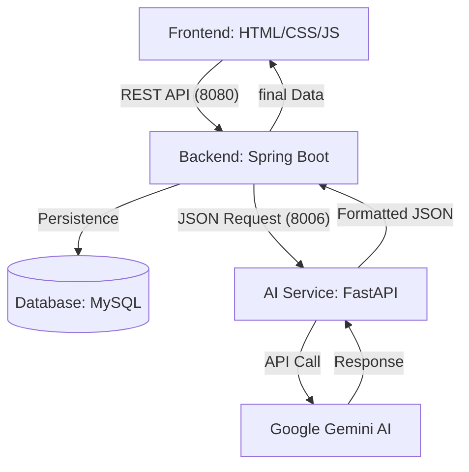
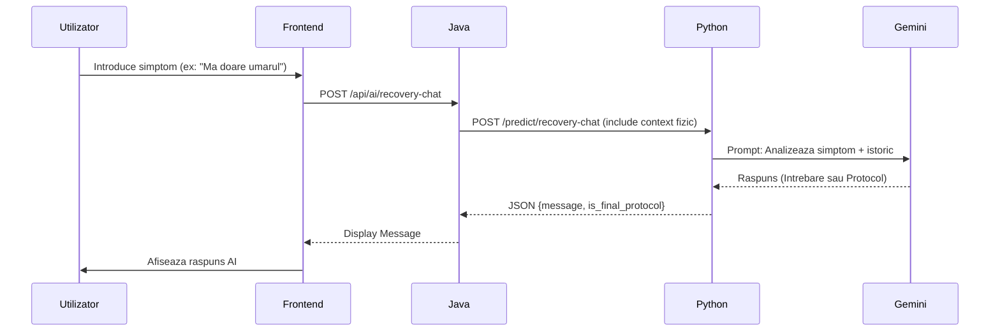
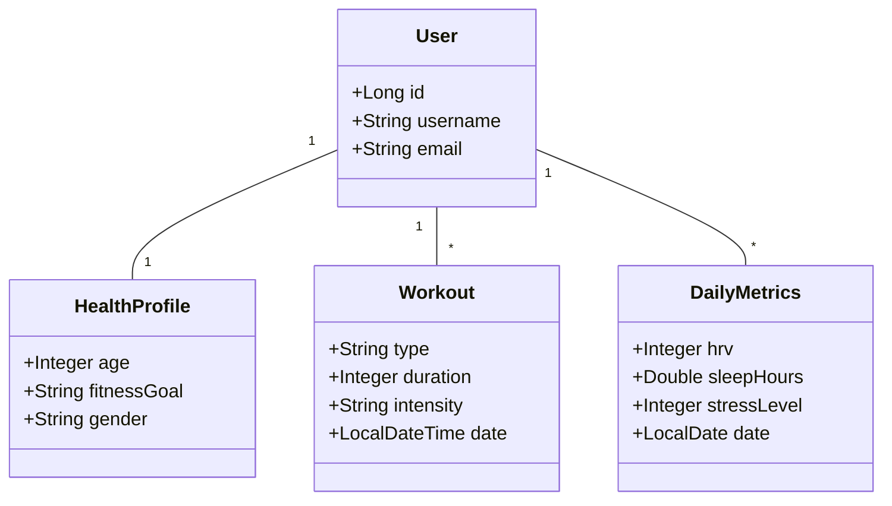

# 🏋️‍♂️ Athletica AI - Your Intelligent Fitness Companion

Athletica AI este o aplicație full-stack modernă concepută pentru monitorizarea performanței fizice, a stării de sănătate și oferirea de recomandări personalizate prin intermediul Inteligenței Artificiale (Google Gemini). Proiectul a fost dezvoltat ca parte a disciplinei **Metode de Dezvoltare Software**.

---

## 🌟 Caracteristici Principale

### 📊 Analiză avansată a Recordurilor Personale (PR)
*   **Monitorizare Evoluție:** Urmărirea progresului pentru peste 15 exerciții fundamentale și olimpice.
*   **AI 1RM Estimation:** Calcularea automată a "One Rep Max" folosind formula Epley.
*   **Predicții Trend:** Analiză bazată pe regresie polinomială pentru a estima performanțele viitoare.

### 🧠 Inteligență Artificială Integrată (Gemini)
*   **Daily AI Coach:** Analizează metricile de sănătate pentru sfaturi zilnice.
*   **Nutri-Coach AI:** Generator de mese și analiză nutrițională bazată pe ingrediente disponibile.
*   **Protocol de Recuperare:** Chatbot interactiv pentru diagnosticarea disconfortului muscular și oferirea de protocoale.
*   **Personal Trainer AI:** Generează antrenamente specifice (ex: CrossFit) bazate pe starea de oboseală și istoric.

### 📈 Monitorizare Sănătate și Activitate
*   **Metrici Zilnice:** Înregistrarea HRV, somn, stres și puls.
*   **Istoric Antrenamente:** Jurnal detaliat al activităților fizice.

---

## 📐 Arhitectură și Diagrame

### 1. Arhitectura Componentelor
Acest grafic descrie modul în care cele trei servicii principale interacționează.



### 2. Fluxul de Recuperare AI (Chatbot)
Descrie procesul decizional al asistentului de recuperare.



### 3. Diagrama de Clase (Modele de Date)



---

## 🏗️ Design Patterns

Proiectul utilizează mai multe pattern-uri de design software pentru a asigura o structură modulară și scalabilă:

1. **Repository Pattern (Data Access)**
   - **Unde:** În backend-ul Java (`UserRepository`, `WorkoutRepository`, `DailyMetricsRepository`).
   - **Rol:** Izolează logica de acces la date de logica de business.

2. **Singleton Pattern**
   - **Unde:** Clasele `@Service` și `@RestController` din Spring Boot.
   - **Rol:** Garantează existența unei singure instanțe pentru serviciile critice.

3. **Dependency Injection (DI)**
   - **Unde:** Utilizarea adnotării `@Autowired` în Spring Boot.
   - **Rol:** Permite decuplarea componentelor prin furnizarea dependențelor din exterior.

4. **Data Transfer Object (DTO)**
   - **Unde:** Obiectele de cerere/răspuns (ex: `WorkoutProposalRequest`).
   - **Rol:** Optimizează transferul de date între serviciul Java și cel de Python.

5. **Observer Pattern**
   - **Unde:** Event listener-ele din Frontend (`script.js`).
   - **Rol:** Actualizarea UI-ului ca reacție la interacțiunile utilizatorului.

---

## 🚀 Instalare și Configurare

### 1. Baza de Date (MySQL)
*   Creați o bază de date MySQL.
*   Configurați datele de acces în `backend-java/app/src/main/resources/application.properties`.

### 2. AI Service (Python)
```bash
cd ai-service-python
pip install -r requirements.txt
# Configurați GEMINI_API_KEY în .env
python main.py
```

### 3. Backend (Java)
```bash
cd backend-java/app
mvn clean install
mvn spring-boot:run
```

---

## 👥 Context Proiect
Realizat pentru laboratorul de **Metode de Dezvoltare Software**. Aplicația demonstrează integrarea microserviciilor și utilizarea AI-ului generativ în fitness.
